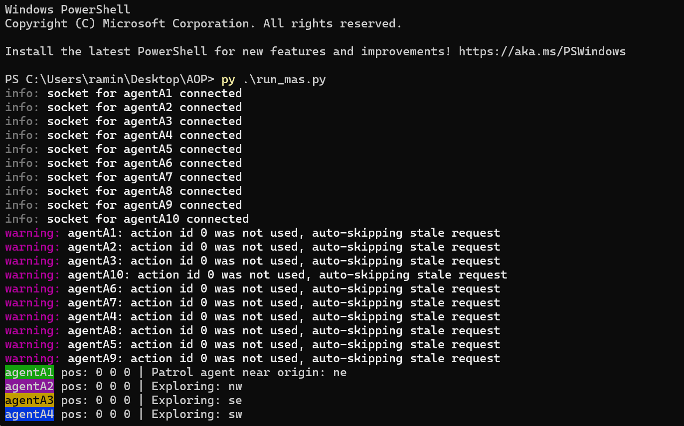
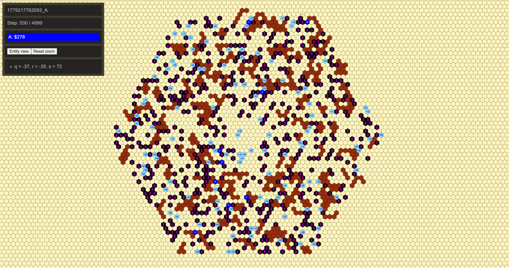
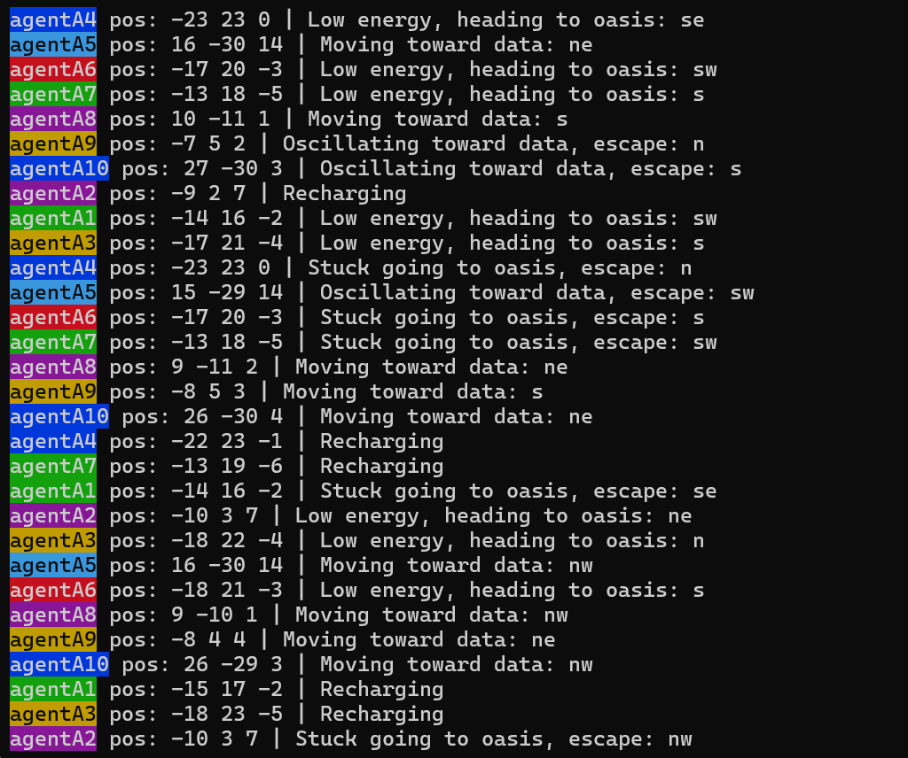

# Multi-Agent Coordination System

A **multi-agent autonomous coordination system** developed for an MAPC-like scenario using **Python, AgentSpeak, and MASSim**.

The project demonstrates autonomous decision-making, cooperative task execution, pathfinding, resource management, and communication between multiple software agents operating in a shared hexagonal environment.

---

## Overview

The system controls a team of up to **10 autonomous agents** operating simultaneously in the MASSim simulation environment.

Agents start at the origin and explore the environment while maintaining knowledge about their surroundings and coordinating with other agents.

Their main objectives include:

* exploring unknown areas,
* avoiding blocked terrain,
* locating and pursuing data,
* managing limited energy,
* navigating toward recharge locations,
* transmitting collected data to the origin,
* and cooperating with other agents when relay-based transmission is required.

The implementation follows a **hybrid architecture**:

* **AgentSpeak** handles high-level symbolic reasoning and behavioral decisions.
* **Python** provides runtime support and computation-heavy functionality such as pathfinding, communication, state management, exploration heuristics, and relay coordination.

---

## Key Features

### Multi-Agent Execution

The system can start between **1 and 10 agents** and connect them to the MASSim simulation server.

All agents use the same AgentSpeak behavior model while making decisions based on their individual:

* position,
* percepts,
* energy level,
* current tasks,
* stored knowledge,
* and interaction with other agents.

---

### Autonomous Exploration

Agents explore the environment using structured exploration rather than relying entirely on random movement.

The exploration system considers:

* previously visited cells,
* team-wide visit counts,
* agent-specific movement ordering,
* known obstacles,
* and exploration boundaries.

This helps reduce unnecessary overlap between agents and improves overall map coverage.

---

### A* Pathfinding

The Python runtime implements **A*-style pathfinding** for navigation.

Pathfinding is used when agents need to move toward:

* discovered data,
* oases,
* the origin,
* or assigned relay positions.

When a valid A* path cannot be found, the system can use bounded or greedy fallback movement to reduce the chance of agents becoming permanently stuck.

---

### Obstacle-Aware Navigation

The environment contains blocked cells represented as mountains.

Agents maintain knowledge of discovered mountains and avoid these cells during:

* path planning,
* exploration,
* and local movement decisions.

The system also maintains shared environmental information that can improve later decisions.

---

### Energy Management

Agents operate with limited energy.

When an agent's energy becomes low, its behavior changes toward finding and reaching a known **oasis** where it can recharge.

The system includes:

* oasis discovery,
* navigation toward recharge locations,
* fallback movement when an agent becomes stuck,
* and recharge behavior.

---

### Data Claiming

The system includes a temporary **data-claiming mechanism**.

Instead of allowing every agent to move toward the same visible data position, data locations can temporarily be assigned to an agent.

This reduces duplicated effort and improves coordinated exploration.

---

### Contract-Net-Inspired Coordination

When data cannot be efficiently transmitted directly to the origin, the system uses a **Contract Net Protocol inspired coordination mechanism**.

A data-carrying agent can act as a manager and announce a relay task.

Other agents may respond with bids depending on conditions such as:

* their current position,
* distance to the origin,
* available energy,
* and whether they are already committed to another task.

The manager then evaluates available bids and prepares a cooperative transfer strategy.

---

### Relay-Based Data Transmission

The system supports cooperative data transmission using relay agents.

Two relay scenarios are supported:

#### Immediate Relay

If suitable agents are already positioned so that a valid transfer route exists, sending and relay actions can be scheduled directly.

#### Mobilized Relay

If relay agents first need to move into appropriate positions, the system assigns movement tasks and schedules the transfer for a later simulation step.

This allows agents to cooperate dynamically instead of acting only as independent entities.

---

## System Architecture

```text
                 MASSim Simulation Server
                          │
                          │
                Socket / JSON Communication
                          │
                          ▼
                 Python Runtime Layer
                     mapc_env.py
                          │
          ┌───────────────┼───────────────┐
          │               │               │
     Pathfinding      Shared State    Communication
          │               │               │
          └───────────────┼───────────────┘
                          │
                          ▼
                 AgentSpeak Reasoning
                     agent.asl
                          │
                          ▼
                Autonomous Decisions

       Explore │ Move │ Recharge │ Send │ Relay
```

The separation between AgentSpeak and Python keeps the system modular.

AgentSpeak determines **what behavior should be executed**, while Python provides the lower-level algorithms and runtime functionality needed to execute those decisions.

---

## Environment Representation

The MASSim environment is represented as a **hexagonal grid using cube coordinates**:

```text
(q, r, s)
```

Agents can move in six directions.

The distance between two positions is calculated using:

```text
d(a, b) = max(|q1 - q2|, |r1 - r2|, |s1 - s2|)
```

The origin is represented as:

```text
(0, 0, 0)
```

This distance calculation is used throughout the system for:

* pathfinding,
* target selection,
* movement toward the origin,
* evaluating relay routes,
* and transmission-related decisions.

---

## Decision Flow

During a simulation step, the system follows a structured processing cycle:

```text
Receive percepts from MASSim
          │
          ▼
Parse percepts and update beliefs
          │
          ▼
Update shared and per-agent state
          │
          ▼
Synchronize agent simulation state
          │
          ▼
Evaluate AgentSpeak plans
          │
          ▼
Use Python support functions
          │
          ▼
Execute an action
          │
          ▼
Move / Send / Relay / Recharge / Skip
```

Percepts are processed before the next reasoning cycle so that agents make decisions using a consistent internal state.

---

## Main Agent Behaviors

The AgentSpeak layer defines plans for behaviors including:

* general exploration,
* local patrol near the origin,
* out-of-zone recovery,
* movement toward discovered data,
* low-energy recovery,
* movement toward oases,
* recharging,
* direct data transmission,
* bidding for relay tasks,
* managing contract-net tasks,
* scheduled sending,
* scheduled relaying,
* and relay positioning.

---

## Technologies

### Languages

* Python
* AgentSpeak

### Concepts

* Multi-Agent Systems
* Agent-Oriented Programming
* Symbolic AI
* Autonomous Agents
* A* Search
* Path Planning
* Distributed Coordination
* Contract Net Protocol
* Task Allocation
* Cooperative Agents
* State Management
* Asynchronous Programming
* Socket Communication

### Platform

* MASSim

---

## Repository Structure

```text
multi-agent-coordination-system/
│
├── agent.asl
│   └── High-level AgentSpeak plans and decision logic
│
├── mapc_env.py
│   └── Python runtime, environment handling, pathfinding,
│       coordination and MASSim communication
│
├── run_mas.py
│   └── Multi-agent startup and server connection
│
├── images/
│   ├── startup-log.png
│   ├── massim-monitor.png
│   └── exploration-log.png
│
├── .gitignore
│
└── README.md
```

---

## Running the System

The project requires a compatible **MASSim server** and the Python/AgentSpeak environment used by the project.

Start the MASSim server first:

```bash
java -jar massim.jar
```

Then start the multi-agent system:

```bash
python run_mas.py
```

On Windows, the Python launcher can also be used:

```powershell
py .\run_mas.py
```

The number of agents can be configured from the command line:

```bash
python run_mas.py --agents 10
```

Additional runtime parameters include:

```text
--host
--port
--connect-timeout
```

Example:

```bash
python run_mas.py --agents 10 --host localhost --port 12300
```

---

## Example Runtime Behaviors

During execution, agents dynamically switch between behaviors such as:

```text
Exploring
Patrolling near origin
Moving toward data
Low energy, heading to oasis
Recharging
Preparing relay task
Moving to relay position
Sending data
Relaying data
```

---

## Execution Screenshots

### Agent Startup

The screenshot below shows the startup phase of the system.

All ten agents establish connections to the MASSim environment and begin executing their initial behaviors.



---

### MASSim Monitor

The MASSim monitor provides a visual representation of the running simulation.

The map contains agents, obstacles, data-related elements, and the current simulation state.



---

### Runtime Exploration and Energy Management

The runtime log below shows several agents making autonomous decisions simultaneously.

Visible behaviors include:

* movement toward data,
* low-energy detection,
* navigation toward oases,
* recharging,
* and recovery when navigation becomes stuck or oscillates.



---

## Project Context

This project was developed as part of an **Agent-Oriented Programming** university project.

The objective was to design and implement a functional multi-agent system capable of autonomous operation and cooperation inside an MAPC-like MASSim environment.

The final implementation combines:

* autonomous decision-making,
* persistent environmental knowledge,
* structured exploration,
* obstacle-aware navigation,
* A*-based path planning,
* energy-aware behavior,
* inter-agent communication,
* distributed task allocation,
* data claiming,
* and coordinated relay execution.

---

## Authors

**Ramin Pourheidar Shirazi**


---

## What I Learned

This project provided practical experience designing software in which several autonomous components must make local decisions while contributing to a shared objective.

Key areas of experience included:

* designing autonomous agent behavior,
* combining symbolic reasoning with algorithmic computation,
* implementing A* search,
* handling navigation on a hexagonal grid,
* managing shared and per-agent state,
* coordinating multiple asynchronous agents,
* implementing resource-aware decision making,
* designing cooperative task allocation,
* handling communication between agents,
* and debugging distributed behavior in a simulation environment.
